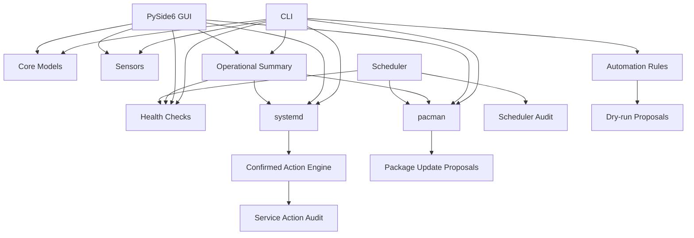

# NEXUS

> A safety-first Linux operations and system intelligence platform for CachyOS.

NEXUS is a local Linux operations platform that turns system telemetry, health checks, service state, package updates, scheduled maintenance, and controlled actions into one auditable workflow. It is designed around a simple operational loop: **observe → diagnose → plan → confirm → execute → audit**.

## Why NEXUS exists

Linux administration often becomes a collection of unrelated commands: `systemctl`, `pacman`, `/proc`, health scripts, timers, and ad-hoc notes. NEXUS provides a consistent interface around those primitives while keeping mutation explicit and inspectable.

The project is intentionally CachyOS-first, but the architecture favors Linux-native interfaces so the core can evolve toward broader Linux support.

## Current status

**Version:** 0.2.0-alpha  
**Platform:** Linux (CachyOS-first)  
**Python:** 3.11+

## Features

- `nexus status` — inspect CPU load, memory, disk, and network state.
- `nexus doctor` — run non-destructive health checks with machine-readable JSON output.
- `nexus summary` — combine health, services, package updates, and scheduler state into one operational view.
- `nexus report` — export a JSON health report.
- `nexus automate` — evaluate safe automation rules in dry-run mode.
- `nexus services` — inspect systemd service state without modifying services.
- `nexus service start|stop|restart ...` — plan controlled service actions with an explicit confirmation gate.
- `nexus packages` — inspect available pacman updates without installing packages.
- `nexus packages update` — turn inspected package updates into confirmation-gated action proposals.
- `nexus history` — inspect recent service-action audit records.
- `nexus-scheduler` — create recurring health/package inspection jobs with persistence and audit history.
- `nexus-scheduler install` — install a user-level systemd service for continuous scheduler operation.
- `nexus-gui` — launch a PySide6 desktop dashboard with live telemetry, services, packages, scheduler state, history, and a Command Center.
- JSON Lines audit logging under `.nexus/` for controlled actions and scheduled executions.
- Standard-library unit tests with injectable command runners for deterministic system integration tests.
- GitHub Actions CI across Python 3.11–3.13.

## Operational model

```text
                 ┌──────────────┐
                 │   Observe    │  /proc /sys / systemd / pacman
                 └──────┬───────┘
                        ↓
                 ┌──────────────┐
                 │   Diagnose   │  doctor + rules
                 └──────┬───────┘
                        ↓
                 ┌──────────────┐
                 │     Plan     │  proposals + risk + rationale
                 └──────┬───────┘
                        ↓
                 ┌──────────────┐
                 │   Confirm    │  explicit authorization
                 └──────┬───────┘
                        ↓
                 ┌──────────────┐
                 │   Execute    │  argument-based commands
                 └──────┬───────┘
                        ↓
                 ┌──────────────┐
                 │    Audit     │  JSONL metadata + result
                 └──────────────┘
```

This separation is the main architectural constraint of the project: **telemetry code does not gain mutation privileges just because it is displayed in the GUI.**

## Quick start

```bash
git clone https://github.com/UseBrainNoL0ve/nexus.git
cd nexus
python -m venv .venv
source .venv/bin/activate
python -m pip install --upgrade pip
python -m pip install -e .

nexus status
nexus doctor
nexus summary
nexus summary --json
nexus services
nexus packages
nexus automate
nexus report --output reports/health.json
nexus-gui
```

### Scheduler

Create recurring read-only maintenance checks:

```bash
nexus-scheduler add health-check --action doctor --every 300
nexus-scheduler add package-check --action packages --every 1800
nexus-scheduler list
nexus-scheduler run
nexus-scheduler history
```

For continuous background execution, NEXUS can install a user-level systemd unit. Installation alone does not start the service:

```bash
nexus-scheduler install
systemctl --user enable --now nexus-scheduler.service
```

Or use `nexus-scheduler install --enable` when you explicitly want NEXUS to enable and start the user service.

## Safety model

NEXUS is deliberately conservative around mutation:

1. **Observation is the default.** Status, doctor, summary, service inspection, and package inspection do not modify the system.
2. **Planning is separate from execution.** Automation and package workflows produce proposals before changes are allowed.
3. **Mutation requires explicit authorization.** Service and package actions are confirmation-gated.
4. **No arbitrary shell execution.** Controlled actions use argument sequences rather than a shell.
5. **Schedulers use an allow-list.** Scheduled actions are limited to built-in, non-destructive operations.
6. **Audit metadata is persistent.** Action decisions and scheduler results are stored without command output or environment secrets.
7. **The GUI follows the same engines.** Desktop buttons do not bypass the CLI/core safety model.

## Architecture



## Project maturity roadmap

- [x] System intelligence CLI
- [x] Health-check/diagnostic engine
- [x] Dry-run automation rules
- [x] systemd inspection and controlled actions
- [x] pacman inspection and confirmation-gated update execution
- [x] Persistent scheduler and execution audit
- [x] User-level systemd scheduler integration
- [x] Desktop GUI foundation
- [x] GUI service/package actions with confirmation
- [x] Unified operational summary in CLI and GUI
- [ ] Asynchronous service/package inspection workers
- [ ] Rich historical telemetry and trend views
- [ ] Plugin API for additional Linux backends
- [ ] Cross-distribution backend abstraction
- [ ] 1.0 stable Linux operations platform

## Development

```bash
source .venv/bin/activate
python -m unittest discover -s tests -v
```

See `docs/architecture.md` for the technical direction and `CONTRIBUTING.md` for contribution conventions.

## License

MIT. See `LICENSE`.
