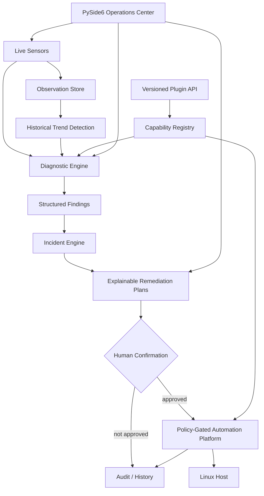

# NEXUS

> A safety-first Linux system intelligence and automation platform for CachyOS.

NEXUS is a local Linux operations platform built around a deliberate pipeline: observe the host, diagnose evidence, model incidents, prepare explainable remediation plans, and only then cross an explicit authorization boundary for mutating actions.

The project is intentionally Linux-native and safety-first. It uses `/proc`, `/sys`, systemd, and pacman where appropriate, keeps privileged behavior behind confirmation gates, and records operational decisions for auditability.

## Why would I use NEXUS?

Most Linux troubleshooting starts with a pile of commands: check memory, inspect services, look for package updates, read logs, and decide what to do next. NEXUS turns those separate checks into one repeatable workflow.

**The practical user story is:**

```text
"Is my machine actually healthy?"
          ↓
      nexus diagnose
          ↓
"What is wrong, why does it matter, and what should I inspect next?"
          ↓
"Here is an explainable proposal. Nothing has been changed."
          ↓
"If I choose to act, the mutation is explicitly confirmed and audited."
```

This makes NEXUS useful as a **personal Linux operations copilot** rather than another system-information dashboard. It is especially useful when you want a fast first-pass diagnosis without blindly running cleanup, service, or package commands.

### What NEXUS can answer

| Question | NEXUS surface | Result |
| --- | --- | --- |
| What is my machine doing right now? | `nexus status` | CPU, memory, disk, network snapshot |
| Is something unhealthy? | `nexus doctor` | Explicit health checks |
| What actually needs attention? | `nexus diagnose` | Findings grouped into incidents |
| Why was it flagged? | `nexus diagnose` | Evidence and deterministic rules |
| What should I do next? | `nexus diagnose` | Explainable remediation proposals |
| What changed over time? | `nexus-observe` / GUI Telemetry | Historical observations and trend detection |
| What is the current incident? | GUI Incidents | Evidence, grouping, and remediation plan |
| Are services failing? | `nexus services` / diagnosis | systemd evidence |
| Are packages waiting for updates? | `nexus packages` / diagnosis | pacman update evidence |
| Can I automate recurring checks? | `nexus-scheduler` | Allow-listed scheduled jobs |
| Can I extend NEXUS? | `nexus-plugins` | Versioned plugin API and capability registry |
| Can I operate this visually? | `nexus-gui` | Desktop operations, incidents, and telemetry |

The important distinction is that **NEXUS does not hide the decision behind an automation button**. Diagnosis and planning are read-only. Mutating actions remain explicit, confirmation-gated, named, and auditable.

## Current status

**Version:** 0.2.0-alpha  
**Platform:** Linux (CachyOS-first)  
**Python:** 3.11+

> Milestone labels in the changelog describe project progress; the package version above is the current Python distribution version.

## Features

### System intelligence

- `nexus status` — inspect CPU load, memory, disk, and network state.
- `nexus doctor` — run non-destructive health checks with JSON output.
- `nexus report` — export a JSON health report.
- `nexus-observe` — persist system observations and inspect historical resource trends.
- Historical anomaly detection for persistent CPU, memory, and disk pressure.

### Diagnostics and incident modeling

- `nexus diagnose` — the main user-facing command for "what needs attention and what should I do next?".
- `nexus-diagnose` — standalone diagnostic entry point for the same analysis pipeline.
- Failed systemd services are surfaced as structured findings.
- Available package updates are represented as informational findings with confirmation metadata.
- Related findings can be grouped into structured incidents.
- Incidents preserve severity, evidence, finding identifiers, and confirmation requirements.

### Explainable remediation

- Remediation proposals are generated from known findings rather than arbitrary shell input.
- Each proposal exposes a rationale, risk level, command representation, and confirmation requirement.
- Diagnostic and remediation layers are planning-only: they do not execute commands.
- Mutating service and package operations remain behind the existing confirmation-gated action engines.

### Operations, GUI, plugins, and automation

- `nexus automate` — evaluate safe automation rules in dry-run mode.
- `nexus services` — inspect systemd service state without modifying services.
- `nexus packages` — inspect available pacman updates without installing packages.
- `nexus packages update` — prepare confirmation-gated package update proposals.
- `nexus service start|stop|restart ...` — plan controlled service actions with an explicit confirmation gate.
- `nexus history` — inspect recent service-action audit records.
- `nexus-scheduler` — manage safe recurring NEXUS jobs.
- `nexus-gui` — launch the PySide6 desktop operations dashboard.
- GUI **Incidents** — investigate current findings and remediation proposals in one place.
- GUI **Telemetry** — visualize persisted CPU, memory, and disk history without an extra charting dependency.
- `nexus-plugins` — inspect installed third-party plugins through the v0.6 versioned plugin API.
- v1 automation platform — named action registry, centralized policy, dry-run execution, confirmation gates, and platform audit logging.
- JSON Lines audit logging under `.nexus/audit.jsonl` for service actions.
- Scheduler execution audit logging under `.nexus/scheduler-audit.jsonl`.
- Platform execution audit logging under `.nexus/platform-audit.jsonl`.

## Operational pipeline



The key boundary is intentional: **observation → diagnosis → planning → authorization → execution → audit**. Plugins and automation extend the platform through named capabilities rather than arbitrary shell access.

## Quick start

```bash
git clone https://github.com/UseBrainNoL0ve/nexus.git
cd nexus
python -m venv .venv
source .venv/bin/activate
python -m pip install --upgrade pip
python -m pip install -e .

# Start here: one command for a read-only system diagnosis.
nexus diagnose

# Machine-readable output for scripts and integrations.
nexus diagnose --json

# Other focused surfaces.
nexus status
nexus doctor
nexus-observe --limit 20
nexus-diagnose
nexus services
nexus packages
nexus packages update
nexus history
nexus-plugins
nexus-plugins --json
nexus report --output reports/health.json
nexus-gui
```

`nexus diagnose` is the recommended starting point because it combines current health evidence, diagnostic findings, incident grouping, and safe next-step proposals without modifying the machine.

`nexus packages` is read-only: it invokes `pacman -Qu` and never installs, removes, or upgrades packages.

`nexus packages update` remains confirmation-gated. It can prepare package update actions, but the diagnostic and planning layers never execute those actions implicitly.

The scheduler accepts only allow-listed NEXUS actions and does not support arbitrary shell commands.

External plugins use the `nexus.plugins` packaging entry-point group and a versioned manifest. See `docs/platform.md` for the extension contract and automation architecture.

## Detailed usage guide

For a command-by-command manual with installation, output interpretation, JSON usage, historical observations, systemd actions, package operations, scheduler usage, audit logs, troubleshooting workflows, safety boundaries, scripting, and a command cheat sheet, see **[docs/usage.md](docs/usage.md)**.

For the plugin API, historical telemetry surface, incident center, and v1 automation runtime, see **[docs/platform.md](docs/platform.md)**.

## Safety model

1. **Observation first:** system state is collected before a decision is made.
2. **Deterministic diagnosis:** findings are derived from explicit rules and evidence.
3. **Explainable planning:** proposed remediation includes a reason and risk boundary.
4. **Explicit authorization:** mutating operations require a separate confirmation step.
5. **Named automation only:** the v1 platform executes registered capabilities, not arbitrary shell strings.
6. **Versioned extensions:** plugins are API-versioned and capability-scoped.
7. **Auditability:** operational decisions are persisted without storing command output or environment secrets.
8. **Fail contained:** collection failures become diagnostic evidence instead of silently triggering mutation.

## Architecture

The repository is organized around clear boundaries:

```text
src/nexus/
├── core/            typed system models
├── sensors/         Linux host telemetry
├── doctor/          non-destructive health checks
├── diagnostics/     structured findings and incidents
├── observability/   persisted observations and trend analysis
├── services/        systemd inspection and actions
├── packages/        pacman inspection and actions
├── scheduler/       safe recurring jobs
├── automation/      rules, action registry, policy, and execution platform
├── plugins/         versioned third-party extension API
├── audit/           operational history
├── reporting/       machine-readable reports
└── gui/             PySide6 operations interface
```

See `docs/architecture.md` for the detailed execution model, `docs/diagnostics.md` for the diagnostic and incident pipeline, `docs/usage.md` for the practical command manual, and `docs/platform.md` for the v0.6/v1 platform contract.

## Roadmap

- [x] v0.1 system intelligence CLI
- [x] v0.2 automation rule engine (dry-run)
- [x] v0.2 systemd inspection and controlled action engine
- [x] v0.2 pacman update inspection (read-only)
- [x] v0.3 package-management action planning (proposal-only)
- [x] v0.4 scheduler and notification layer
- [x] v0.5 desktop GUI foundation and operations pages
- [x] diagnostic engine and structured findings
- [x] historical observation and anomaly detection
- [x] incident modeling and explainable remediation planning
- [x] integrated `nexus diagnose` command center
- [x] GUI incident/remediation center
- [x] richer historical visualization
- [x] v0.6 plugin system
- [x] v1.0 complete Linux automation platform

## Development

```bash
python -m unittest discover -s tests -v
```

For deterministic integration tests, system command runners are injectable. New system mutations must have focused tests, a dry-run or proposal path, and an explicit authorization boundary.

See `CONTRIBUTING.md` for the branch, test, commit, documentation, and safety workflow.

## License

MIT. See `LICENSE`.
