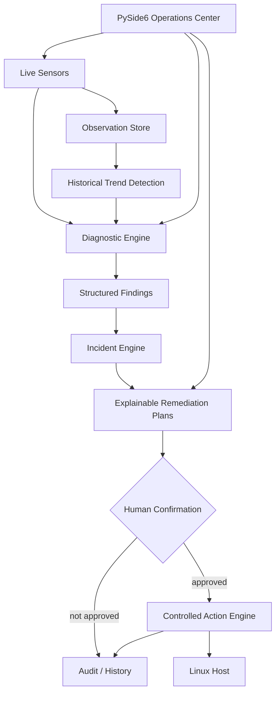

# NEXUS

> A safety-first Linux system intelligence and automation platform for CachyOS.

NEXUS is a local Linux operations platform built around a deliberate pipeline: observe the host, diagnose evidence, model incidents, prepare explainable remediation plans, and only then cross an explicit authorization boundary for mutating actions.

The project is intentionally Linux-native and safety-first. It uses `/proc`, `/sys`, systemd, and pacman where appropriate, keeps privileged behavior behind confirmation gates, and records operational decisions for auditability.

## Current status

**Version:** 0.2.0-alpha  
**Platform:** Linux (CachyOS-first)  
**Python:** 3.11+

> Milestone labels in the changelog describe project progress; the package version above is the current Python distribution version.

## Features

### System intelligence

- `nexus status` — inspect CPU load, memory, disk, and network state.
- `nexus doctor` — run non-destructive health checks with JSON output.
- `nexus report` — export a JSON health report.
- `nexus-observe` — persist system observations and inspect historical resource trends.
- Historical anomaly detection for persistent CPU, memory, and disk pressure.

### Diagnostics and incident modeling

- `nexus-diagnose` — produce deterministic diagnostic findings from current system evidence.
- Failed systemd services are surfaced as structured findings.
- Available package updates are represented as informational findings with confirmation metadata.
- Related findings can be grouped into structured incidents.
- Incidents preserve severity, evidence, finding identifiers, and confirmation requirements.

### Explainable remediation

- Remediation proposals are generated from known findings rather than arbitrary shell input.
- Each proposal exposes a rationale, risk level, command representation, and confirmation requirement.
- Diagnostic and remediation layers are planning-only: they do not execute commands.
- Mutating service and package operations remain behind the existing confirmation-gated action engines.

### Operations and desktop UI

- `nexus automate` — evaluate safe automation rules in dry-run mode.
- `nexus services` — inspect systemd service state without modifying services.
- `nexus packages` — inspect available pacman updates without installing packages.
- `nexus packages update` — prepare confirmation-gated package update proposals.
- `nexus service start|stop|restart ...` — plan controlled service actions with an explicit confirmation gate.
- `nexus history` — inspect recent service-action audit records.
- `nexus-scheduler` — manage safe recurring NEXUS jobs.
- `nexus-gui` — launch the PySide6 desktop operations dashboard.
- JSON Lines audit logging under `.nexus/audit.jsonl` for service actions.
- Scheduler execution audit logging under `.nexus/scheduler-audit.jsonl`.

## Operational pipeline



The key boundary is intentional: **observation → diagnosis → planning → authorization → execution → audit**.

## Quick start

```bash
git clone https://github.com/UseBrainNoL0ve/nexus.git
cd nexus
python -m venv .venv
source .venv/bin/activate
python -m pip install --upgrade pip
python -m pip install -e .

nexus status
nexus doctor
nexus diagnose
nexus-observe --limit 20
nexus-diagnose
nexus-diagnose --json
nexus services
nexus packages
nexus packages update
nexus history
nexus report --output reports/health.json
nexus-gui
```

If `nexus diagnose` is not yet available in the installed checkout, use the standalone diagnostic entry point `nexus-diagnose`. The integrated CLI command is part of the planned command-center consolidation.

`nexus packages` is read-only: it invokes `pacman -Qu` and never installs, removes, or upgrades packages.

`nexus packages update` remains confirmation-gated. It can prepare package update actions, but the diagnostic and planning layers never execute those actions implicitly.

The scheduler accepts only allow-listed NEXUS actions and does not support arbitrary shell commands.

## Safety model

1. **Observation first:** system state is collected before a decision is made.
2. **Deterministic diagnosis:** findings are derived from explicit rules and evidence.
3. **Explainable planning:** proposed remediation includes a reason and risk boundary.
4. **Explicit authorization:** mutating operations require a separate confirmation step.
5. **No arbitrary shell:** higher-level NEXUS features do not accept free-form shell execution.
6. **Auditability:** operational decisions are persisted without storing command output or environment secrets.
7. **Fail contained:** collection failures become diagnostic evidence instead of silently triggering mutation.

## Architecture

The repository is organized around clear boundaries:

```text
src/nexus/
├── core/            typed system models
├── sensors/         Linux host telemetry
├── doctor/          non-destructive health checks
├── diagnostics/     structured findings and incidents
├── observability/   persisted observations and trend analysis
├── services/        systemd inspection and actions
├── packages/        pacman inspection and actions
├── scheduler/       safe recurring jobs
├── audit/           operational history
├── reporting/       machine-readable reports
└── gui/             PySide6 operations interface
```

See `docs/architecture.md` for the detailed execution model and `docs/diagnostics.md` for the diagnostic and incident pipeline.

## Roadmap

- [x] v0.1 system intelligence CLI
- [x] v0.2 automation rule engine (dry-run)
- [x] v0.2 systemd inspection and controlled action engine
- [x] v0.2 pacman update inspection (read-only)
- [x] v0.3 package-management action planning (proposal-only)
- [x] v0.4 scheduler and notification layer
- [x] v0.5 desktop GUI foundation and operations pages
- [x] diagnostic engine and structured findings
- [x] historical observation and anomaly detection
- [x] incident modeling and explainable remediation planning
- [ ] integrated `nexus diagnose` command center
- [ ] GUI incident/remediation center
- [ ] richer historical visualization
- [ ] v0.6 plugin system
- [ ] v1.0 complete Linux automation platform

## Development

```bash
python -m unittest discover -s tests -v
```

For deterministic integration tests, system command runners are injectable. New system mutations must have focused tests, a dry-run or proposal path, and an explicit authorization boundary.

See `CONTRIBUTING.md` for the branch, test, commit, documentation, and safety workflow.

## License

MIT. See `LICENSE`.
