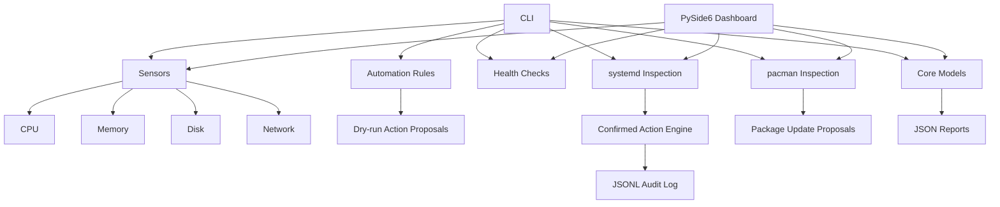

# NEXUS

> A safety-first Linux system intelligence and automation platform for CachyOS.

NEXUS is a local Linux operations platform that observes system health, inspects systemd services and pacman updates, proposes controlled actions, records service-action audit events, and provides a read-only desktop dashboard. Mutating operations remain explicitly confirmation-gated.

## Current status

**Version:** 0.2.0-alpha  
**Platform:** Linux (CachyOS-first)  
**Python:** 3.11+

## Features

- `nexus status` — inspect CPU load, memory, disk, and network state.
- `nexus doctor` — run non-destructive health checks, including machine-readable JSON output.
- `nexus report` — export a JSON health report.
- `nexus automate` — evaluate safe automation rules in dry-run mode.
- `nexus services` — inspect systemd service state without modifying services, including JSON output.
- `nexus packages` — inspect available pacman updates without installing packages, including JSON output.
- `nexus packages update` — turn inspected package updates into confirmation-gated action proposals without executing them.
- `nexus service start|stop|restart ...` — plan controlled service actions with an explicit confirmation gate.
- `nexus history` — inspect recent service-action audit records.
- `nexus-gui` — launch a PySide6 read-only desktop dashboard for live local system information.
- JSON Lines audit logging under `.nexus/audit.jsonl` for blocked and attempted service actions.
- Standard-library unit tests with injectable command runners for deterministic system integration tests.
- GitHub Actions CI across Python 3.11–3.13.

## Architecture



## Quick start

```bash
git clone https://github.com/UseBrainNoL0ve/nexus.git
cd nexus
python -m venv .venv
source .venv/bin/activate
python -m pip install --upgrade pip
python -m pip install -e .
nexus status
nexus doctor
nexus doctor --json
nexus automate
nexus services
nexus packages
nexus packages update
nexus history
nexus report --output reports/health.json
nexus-gui
```

`nexus packages` is read-only: it invokes `pacman -Qu` and never installs, removes, or upgrades packages.

`nexus packages update` remains planning-only: it displays the command that would be used for each inspected update, marks the proposal as requiring confirmation, and performs no package mutation.

The initial desktop dashboard is also read-only. It refreshes local status, health checks, service counts, and package-update counts without executing mutating operations.

For service actions, inspect first and use dry-run mode before considering explicit confirmation:

```bash
nexus service restart NetworkManager.service --dry-run
nexus history --limit 20
```

The action engine executes commands without a shell and records action metadata in `.nexus/audit.jsonl`. No command output or environment secrets are written to the audit log.

## Design principles

1. **Safety first:** observation and planning come before mutation.
2. **Explicit authorization:** mutating actions require a separate confirmation gate.
3. **Observable before automated:** new actions receive a read-only or dry-run path first.
4. **Linux-native:** prefer `/proc`, `/sys`, systemd, and pacman where appropriate.
5. **Testable:** system integrations accept injectable command runners.
6. **Auditable:** action decisions and results are persisted without recording command output or secrets.
7. **Professional engineering:** focused commits, tests, documentation, and CI accompany feature work.

## Roadmap

- [x] v0.1 system intelligence CLI
- [x] v0.2 automation rule engine (dry-run)
- [x] v0.2 systemd inspection and controlled action engine
- [x] v0.2 pacman update inspection (read-only)
- [x] v0.3 package-management action planning (proposal-only)
- [ ] v0.4 scheduler and notification layer
- [x] v0.5 desktop GUI foundation
- [ ] v0.5 desktop GUI actions and richer visualization
- [ ] v0.6 plugin system
- [ ] v1.0 complete Linux automation platform

## Development

```bash
python -m unittest discover -s tests -v
```

See `docs/architecture.md` for the technical direction and `CONTRIBUTING.md` for contribution conventions.

## License

MIT. See `LICENSE`.
