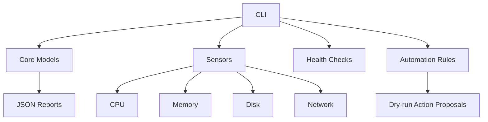

# NEXUS

> A safety-first Linux system intelligence and automation platform for CachyOS.

NEXUS starts as a local, read-only system intelligence CLI. It collects useful health metrics, diagnoses common conditions, and exports machine-readable reports. Mutating operations are intentionally postponed until a permission and confirmation model exists.

## Current status

**Version:** 0.2.0-alpha  
**Platform:** Linux (CachyOS-first)  
**Python:** 3.11+

## Features

- `nexus status` — inspect CPU, memory, disk, and network state.
- `nexus doctor` — run non-destructive health checks.
- `nexus report` — export a JSON health report.
- `nexus automate` — evaluate safe automation rules in dry-run mode.
- Structured `src/` package layout.
- Unit tests with the standard library test runner.
- GitHub Actions CI across Python 3.11–3.13.

## Architecture



## Quick start

```bash
git clone https://github.com/UseBrainNoL0ve/nexus.git
cd nexus
python -m venv .venv
source .venv/bin/activate
python -m pip install --upgrade pip
python -m pip install -e .
nexus status
nexus doctor
nexus automate
nexus report --output reports/health.json
```

## Design principles

1. **Safety first:** automation currently proposes actions but does not execute them.
2. **Observable before automated:** future actions get a dry-run path before mutation.
3. **Linux-native:** prefer `/proc`, `/sys`, systemd, and the host package manager where appropriate.
4. **Testable:** sensors and decision logic stay separated from the CLI.
5. **Auditable:** reports, logs, and conventional commits make behavior easy to inspect.

## Roadmap

- [x] v0.1 system intelligence CLI
- [x] v0.2 automation rule engine (dry-run)
- [ ] v0.3 systemd and package-management integrations
- [ ] v0.4 scheduler and notification layer
- [ ] v0.5 desktop GUI
- [ ] v0.6 plugin system
- [ ] v1.0 complete Linux automation platform

## Development

```bash
python -m unittest discover -s tests -v
```

See `docs/architecture.md` for the technical direction and `CONTRIBUTING.md` for contribution conventions.

## License

MIT. See `LICENSE`.
